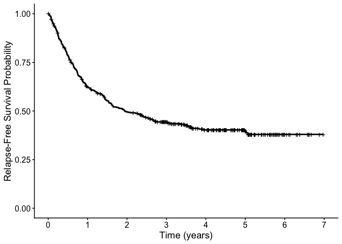
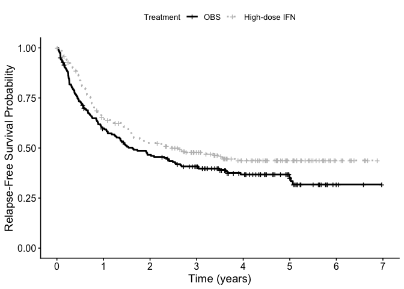

<!-- README.md is generated from README.Rmd. Please edit that file -->

# BayesSMCM

<!-- badges: start --
&#10;[](https://github.com/fatihki/BayesSMCM/actions)
[](https://cran.r-project.org/package=BayesSMCM)
&#10;-- badges: end -->

[](https://opensource.org/licenses/MIT)

This is an R package **BayesSMCM** implementing Bayesian hierarchical
modeling for the semiparametric mixture cure model (SMCM), which
accommodates both the inclusion and exclusion of a frailty component
[Kızılaslan F and Vitelli V,
2025](https://doi.org/10.48550/arXiv.2408.17188).

## Installation

Install the latest development version from
[GitHub](https://github.com/fatihki/BayesSMCM)

``` r
library(BayesSMCM)
```

## Data example

``` r
# simulate data
n <- 300
b.true <- c( 0.4, 0.5, 0.1)
beta.true <- c(1, 0.2 )
baseline.hazard.rates <- 1
intervals <- c(0, 16)
prob.cov.X <- c(0.5)
prob.cov.Z <- c(0.5)
dat1 <- simSMCM(n, b.true, beta.true, baseline.hazard.rates, intervals, seed = 2026, cens.start = 30/365, cens.end = 32,  prob.cov.X, prob.cov.Z, same.cov = TRUE )
str(dat1)
#> List of 9
#>  $ b.true               : num [1:3] 0.4 0.5 0.1
#>  $ beta.true            : num [1:2] 1 0.2
#>  $ baseline.hazard.rates: num 1
#>  $ X                    : num [1:300, 1:2] 0 1 0 1 1 0 1 0 1 1 ...
#>  $ Z                    : num [1:300, 1:3] 1 1 1 1 1 1 1 1 1 1 ...
#>  $ observed_time        : num [1:300] 0.644 0.197 0.465 0.386 0.428 ...
#>  $ delta                : num [1:300] 1 1 1 1 1 1 1 1 0 1 ...
#>  $ censor.rate          : num 0.33
#>  $ intervals            : num [1:2] 0 16
```

``` r
# Bayesian settings 
nchains = 2; nIter   = 2500;   warmup = 500; thin = 10

# prior for SMCMs
priorPar.smcm = list( r1 = 1, delta1 = 0.0001, r2 = 1, delta2 = 0.0001, a = 0.1, b = 0.1 )

# prior settings for SMCFMs
priorPar.smcfm = list( r1 = 1, delta1 = 0.0001, r2 = 1, delta2 = 0.0001, a = 0.1, b = 0.1, c = 0.1, d = 0.1 )
```

## Models based on MCMC algorithm

### Fitting SMCM.MCMC model

``` r
out.smcm.mcmc = fit.MCMC.SMCM ( data = dat1, hyperpar = priorPar.smcm, nchains, nIter, warmup, thin, mcmc.parallel = "parLapply", standardize = TRUE, probs = 0, save_loglik = 1, seed = 2025 )
```

``` r
print_smcm( out.smcm.mcmc, stan.model = FALSE, frailty = FALSE )
#> 
#> - SMCM.MCMC Model Results (J = 1 ) 
#>           Estimate(Mean)     SD HPD lower HPD upper   Rhat
#> b[0]              0.4552 0.1818    0.1066    0.8106 0.9983
#> b[1]              0.7398 0.2889    0.1951    1.3352 1.0131
#> b[2]              0.0465 0.1316   -0.2012    0.3161 1.0031
#> beta[1]           0.8221 0.1640    0.5037    1.1243 1.0639
#> beta[2]           0.1437 0.0786   -0.0192    0.2866 1.0068
#> lambda[1]         1.1756 0.1356    0.9058    1.4501 1.0749
#> pi(z)             0.6902 0.0284    0.6329    0.7420 0.9976
```

## E1690 analysis

``` r
data.E1690 = E1690
data.E1690.RFS <- data.E1690[data.E1690$failtime > 0, ]

real.data.RFS = list()
real.data.RFS$X =  as.matrix( cbind( trt=data.E1690.RFS$trt, 
                                     age=data.E1690.RFS$age, 
                                     sex=data.E1690.RFS$sex  ) )
head(real.data.RFS$X)
#>      trt     age sex
#> [1,]   0 34.2834   0
#> [2,]   0 38.1711   0
#> [3,]   1 46.7023   0
#> [4,]   0 56.2382   0
#> [5,]   1 40.6571   0
#> [6,]   0 37.5880   1
real.data.RFS$Z =  cbind(1, real.data.RFS$X)
head(real.data.RFS$Z)
#>        trt     age sex
#> [1,] 1   0 34.2834   0
#> [2,] 1   0 38.1711   0
#> [3,] 1   1 46.7023   0
#> [4,] 1   0 56.2382   0
#> [5,] 1   1 40.6571   0
#> [6,] 1   0 37.5880   1

real.data.RFS$observed_time = data.E1690.RFS$failtime 
real.data.RFS$delta         = data.E1690.RFS$rfscens 
```

Kaplan–Meier estimates for overall survival.

``` r
library(survival)
library(survminer)
#> Loading required package: ggplot2
#> Want to understand how all the pieces fit together? Read R for Data Science: https://r4ds.hadley.nz/
#> Loading required package: ggpubr
#> 
#> Attaching package: 'survminer'
#> The following object is masked from 'package:survival':
#> 
#>     myeloma

fit.E1690.RFS <- survfit(Surv(failtime, rfscens) ~ 1, data = data.E1690.RFS) 

real.data1.p1 = ggsurvplot(
  fit.E1690.RFS,
  conf.int = FALSE,
  palette  = "black",
  xlab = "Time (years)",
  ylab = "Relapse-Free Survival Probability",
  legend = "none",
  censor.size = 4,
  xlim = c(0, 7),
  break.x.by = 1
)
#> Warning: Using `size` aesthetic for lines was deprecated in ggplot2 3.4.0.
#> ℹ Please use `linewidth` instead.
#> ℹ The deprecated feature was likely used in the ggpubr package.
#>   Please report the issue at <https://github.com/kassambara/ggpubr/issues>.
#> This warning is displayed once every 8 hours.
#> Call `lifecycle::last_lifecycle_warnings()` to see where this warning was generated.
real.data1.p1
```



Kaplan–Meier estimates for overall survival stratified by treatment.

``` r
fit.E1690.RFS.trt <- survfit(Surv(failtime, rfscens) ~ trt, data = data.E1690.RFS)
real.data1.p2 = 
  ggsurvplot(
    fit.E1690.RFS.trt,
    conf.int = FALSE,
    palette = c("black", "gray"),     # both curves black
    linetype = c("solid", "dotted"),   # one solid, one dashed
    xlab = "Time (years)",
    ylab = "Relapse-Free Survival Probability",
    legend.title = "Treatment",
    legend.labs = c("OBS", "High-dose IFN"),  # labels for trt=0 and trt=1
    censor = T,
    censor.size = 4,
    xlim = c(0, 7),
    break.x.by = 1
  )
real.data1.p2
```



## References

Kızılaslan, F., Vitelli, V. (2025). Bayesian Semiparametric Mixture Cure
(Frailty) Model. [arXiv:???](https://arxiv.org/???)
