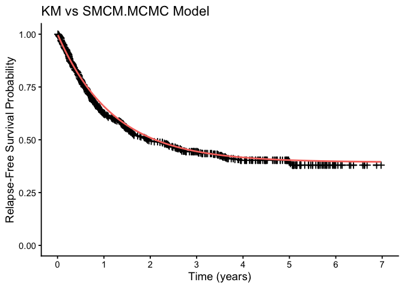

<!-- README.md is generated from README.Rmd. Please edit that file -->

# BayesSMCM

<!-- badges: start --
&#10;[](https://github.com/fatihki/BayesSMCM/actions)
[](https://cran.r-project.org/package=BayesSMCM)
&#10;-- badges: end -->

[](https://opensource.org/licenses/MIT)

This is an R package **BayesSMCM** implementing Bayesian hierarchical
modeling for the semiparametric mixture cure model (SMCM), which
accommodates both the inclusion and exclusion of a frailty component
[Kızılaslan F and Vitelli V, 2025](https://arxiv.org/???).

## Installation

Install the latest development version from
[GitHub](https://github.com/fatihki/BayesSMCM)

``` r
library(BayesSMCM)
```

## A simulation study

We present an example of the proposed models in \[Kızılaslan and
Vitelli, 2025\]. A dataset is generated as Scenario 1 given in
\[Kızılaslan and Vitelli, 2025\]. In Scenario $1$, we assume an
exponential distribution for the baseline survival function with
$\lambda=1$, i.e. $J=1$. Two covariates, $\mathbf{Z_1}$ and
$\mathbf{Z_2}$ are independently generated respectively from a Bernoulli
distribution with probability $0.5$, i.e. Bernoulli$(0.5),$ and from a
standard normal distribution, i.e. $N(0,1)$. The covariates $\mathbf{X}$
and $\mathbf{Z}$ are assumed to be the same. The true regression
coefficients are set as $(b_0, b_1, b_2) = (0.4, 0.5, 1)$ and
$(\beta_1, \beta_2) = (1, 0.2)$. Following the specified parameter
settings, the survival data is generated using SMCM. We set the number
of observations to $n = 300$.

``` r
n <- 300
b.true <- c( 0.4, 0.5, 0.1)
beta.true <- c(1, 0.2 )
baseline.hazard.rates <- 1
intervals <- c(0, 16)
prob.cov.X <- c(0.5)
prob.cov.Z <- c(0.5)
dat1 <- simSMCM(n, b.true, beta.true, baseline.hazard.rates, intervals, seed = 2026, 
                cens.start = 30/365, cens.end = 32,  prob.cov.X, prob.cov.Z, same.cov = TRUE )
```

For the simulated `dat1`, we run three chains with $7500$ iterations for
all methods in the simulation. After discarding the first $2500$
iterations as burn-in, and applying a thinning of size $10$ to each
chain, we retain $500$ iterations per chain, resulting in a total of
$1500$ samples for posterior inference. For monitoring the convergence
of the posterior samples, the estimated potential scale reduction factor
(Gelman and Rubin), Rhat, for all unknown parameters are evaluated.

``` r
# Bayesian settings:
nchains = 3; nIter   = 7500;   warmup = 2500; thin = 10
# priors for SMCMs
priorPar.smcm = list( r1 = 1, delta1 = 1e-04, r2 = 1, delta2 = 1e-04, a = 0.1, b = 0.1 )
# priors for SMCFMs
priorPar.smcfm = list( r1 = 1, delta1 = 1e-04, r2 = 1, delta2 = 1e-04, a = 0.1, b = 0.1, c = 0.1, d = 0.1 )
```

### Models based on MCMC algorithm

Here, we only consider the case of $J = 1$, in which probs is defined as
`probs = 0`. If we want to fit any of the proposed models for $J = 2$,
probs can be defined as `probs = 0.5` or any other quantile value.
Moreover, for $J = 3$, you can define a vector such as
`probs = c(0.35, 0.70)` or similar.

#### Fitting SMCM.MCMC model

``` r
out.smcm.mcmc = fit.MCMC.SMCM( data = dat1, hyperpar = priorPar.smcm, 
                                nchains, nIter, warmup, thin, mcmc.parallel = "parLapply",
                                standardize = FALSE, probs = 0, save_loglik = 1, seed = 2025 )
```

``` r
print_smcm( out.smcm.mcmc, stan.model = FALSE, frailty = FALSE )
#> 
#> - SMCM.MCMC Model Results (J = 1 ) 
#>           Estimate(Mean)     SD HPD lower HPD upper   Rhat
#> b[0]              0.4381 0.1739    0.0954    0.7552 0.9998
#> b[1]              0.7631 0.2755    0.2651    1.3316 1.0014
#> b[2]              0.0393 0.1266   -0.2105    0.2973 0.9993
#> beta[1]           0.8156 0.1554    0.4877    1.0875 1.0003
#> beta[2]           0.1413 0.0764   -0.0085    0.2851 1.0030
#> lambda[1]         1.1944 0.1367    0.9517    1.4705 1.0018
#> pi(z)             0.6881 0.0272    0.6293    0.7338 1.0004
```

#### Fitting SMCFM.MCMC model

``` r
out.smcfm.mcmc = fit.MCMC.SMCFM( data = dat1, hyperpar = priorPar.smcfm, 
                                  nchains, nIter, warmup, thin, mcmc.parallel = "parLapply",
                                  standardize = FALSE, probs = 0, save_loglik = 1, seed = 2025 )
```

``` r
print_smcm( out.smcfm.mcmc, stan.model = FALSE, frailty = TRUE )
#> 
#> - SMCFM.MCMC Model Results (J = 1 ) 
#>           Estimate(Mean)      SD HPD lower HPD upper   Rhat
#> b[0]              0.4265  0.1760    0.0872    0.7681 1.0125
#> b[1]              0.7842  0.2728    0.2350    1.3015 1.0091
#> b[2]              0.0393  0.1177   -0.1949    0.2675 1.0056
#> beta[1]           0.8097  0.1579    0.5280    1.1465 1.0043
#> beta[2]           0.1405  0.0786   -0.0043    0.3002 1.0030
#> lambda[1]         1.2132  0.1444    0.9400    1.4904 1.0045
#> theta            75.3057 26.7790   29.0350  130.2588 1.0084
#> pi(z)             0.6876  0.0272    0.6330    0.7370 1.0041
```

### Models based on RStan

#### Fitting SMCM.Rstan model

Priors setting for SMCM.Rstan model.

``` r
priorPar.smcm.rstan = list( sigma_beta = 1000, sigma_b = 1000, a = 0.1, b = 0.1)
```

``` r
print_smcm( out.smcm.rstan, stan.model = TRUE, frailty = FALSE)
#> 
#> - SMCM.RStan Model Results (J = 1 ) 
#>           Estimate(Mean)     SD HPD lower HPD upper   Rhat
#> b[0]              0.4350 0.1735    0.1055    0.7660 1.0003
#> b[1]              0.8678 0.2704    0.3521    1.3970 1.0011
#> b[2]              0.0512 0.1421   -0.2331    0.3067 0.9987
#> beta[1]           0.8412 0.1492    0.5373    1.1262 0.9989
#> beta[2]           0.1526 0.0772    0.0109    0.3077 0.9999
#> lambda[1]         1.1835 0.1354    0.9295    1.4470 0.9998
#> pi(z)             0.6965 0.0268    0.6438    0.7450 1.0002
```

#### Fitting SMCFM.Rstan model

Priors setting for SMCFM.Rstan model.

``` r
priorPar.smcfm.rstan = list( sigma_beta = 1000, sigma_b = 1000,a = 0.1, b = 0.1,  c = 0.1, d = 0.1 )
```

``` r
print_smcm( out.smcfm.rstan, stan.model = TRUE, frailty = TRUE)
#> 
#> - SMCFM.RStan Model Results (J = 1 ) 
#>           Estimate(Mean)     SD HPD lower HPD upper   Rhat
#> b[0]              0.4515 0.1757    0.1301    0.7865 0.9996
#> b[1]              0.8407 0.2681    0.3504    1.3523 1.0001
#> b[2]              0.0374 0.1420   -0.2293    0.3230 1.0001
#> beta[1]           0.8127 0.1582    0.4990    1.0994 1.0047
#> beta[2]           0.1548 0.0795   -0.0065    0.3045 0.9997
#> lambda[1]         1.2581 0.1562    0.9466    1.5561 1.0059
#> theta            18.3390 9.9737    4.6535   39.3999 0.9993
#> pi(z)             0.6976 0.0274    0.6396    0.7481 0.9998
```

#### Fitting HSMCM.Rstan model

``` r
print_smcm( out.hsmcm.rstan, stan.model = TRUE, frailty = FALSE)
#> 
#> - HSMCM.RStan Model Results (J = 1 ) 
#>           Estimate(Mean)     SD HPD lower HPD upper   Rhat
#> b[0]              0.4417 0.1695    0.1083    0.7735 0.9999
#> b[1]              0.7246 0.2607    0.2223    1.2250 0.9994
#> b[2]              0.0369 0.1205   -0.1887    0.2782 1.0007
#> beta[1]           0.7739 0.1556    0.4736    1.0762 1.0012
#> beta[2]           0.1376 0.0713    0.0018    0.2747 1.0017
#> lambda[1]         1.2318 0.1405    0.9626    1.5159 1.0004
#> pi(z)             0.6854 0.0273    0.6274    0.7341 1.0027
```

#### Fitting HSMCFM.Rstan model

``` r
print_smcm( out.hsmcfm.rstan, stan.model = TRUE, frailty = TRUE)
#> 
#> - HSMCFM.RStan Model Results (J = 1 ) 
#>           Estimate(Mean)     SD HPD lower HPD upper   Rhat
#> b[0]              0.4371 0.1716    0.1192    0.7923 1.0029
#> b[1]              0.7418 0.2638    0.2578    1.3069 1.0045
#> b[2]              0.0412 0.1180   -0.1820    0.2710 1.0015
#> beta[1]           0.7343 0.1706    0.4103    1.0735 0.9999
#> beta[2]           0.1395 0.0813   -0.0319    0.2783 1.0003
#> lambda[1]         1.3236 0.1709    0.9920    1.6468 1.0021
#> theta            16.8211 9.1857    4.3084   34.2509 1.0019
#> pi(z)             0.6860 0.0274    0.6327    0.7394 1.0003
```

## Real data analysis: ECOG E1690 clinical trial data

The ECOG E1690 trial evaluated the efficacy of Interferon Alfa-2b (IFN)
as adjuvant therapy following surgical resection of deep primary or
regionally metastatic melanoma, with a comprehensive account provided by
\[Kirkwood et al., 2000\].

The outcome of interest is relapse-free survival (RFS), defined as the
time from randomization until tumor progression or death, whichever
occurs first \[Ibrahim et al., 2012\]. After excluding $10$ patients
with zero RFS, the dataset includes $n=417$ patients, with approximately
$42\%$ censoring across the two treatment arms. The dataset in this
application comprises: $t:$ observed RFS in years (mean $2.31$ years);
$\delta:$ censoring indicator ($177$ right-censored observations);
$x_1:$ treatment group ($212$ patients in the high-dose IFN arm = 1,
$205$ in the observation arm = 0); $x_2:$ age (continuous, range
$19.13$–$78.05$, mean $48.05$ years); and $x_3:$ sex ($261$ male = 0,
$156$ female = 1). For the incidence part of the model, we use the same
covariates in addition to the intercept, i.e.,
$\mathbf{z} = [\mathbf{1}, \mathbf{x}]$. Among patients who did not
experience relapse, both the median and mean follow-up times exceeded
four years. The following figures display Kaplan–Meier (KM) estimates of
the survival curves overall and stratified by treatment group (high-dose
IFN vs. observation). A clear plateau at approximately four years
suggests the presence of long-term survivors, motivating the use of a
cure rate model for this dataset.

We here apply only two proposed mixture cure model approaches- SMCM
(MCMC) and HSMCM (RStan)- to the E1690 dataset. As an example we set
$J = 1$ for the semiparametric structure. For each method, we run five
MCMC chains of $7500$ iterations, discarding the first $2500$ as warm-up
and applying a thinning by $10$, resulting in $2500$ posterior samples
in total. See more details and full analysis in \[Kızılaslan and
Vitelli, 2025\].

``` r
data.E1690 = E1690
data.E1690.RFS <- data.E1690[data.E1690$failtime > 0, ]

real.data.RFS = list()
real.data.RFS$X =  as.matrix( cbind( trt=data.E1690.RFS$trt, 
                                     age=data.E1690.RFS$age, 
                                     sex=data.E1690.RFS$sex  ) )
head(real.data.RFS$X)
#>      trt     age sex
#> [1,]   0 34.2834   0
#> [2,]   0 38.1711   0
#> [3,]   1 46.7023   0
#> [4,]   0 56.2382   0
#> [5,]   1 40.6571   0
#> [6,]   0 37.5880   1
real.data.RFS$Z =  cbind(1, real.data.RFS$X)
head(real.data.RFS$Z)
#>        trt     age sex
#> [1,] 1   0 34.2834   0
#> [2,] 1   0 38.1711   0
#> [3,] 1   1 46.7023   0
#> [4,] 1   0 56.2382   0
#> [5,] 1   1 40.6571   0
#> [6,] 1   0 37.5880   1

real.data.RFS$observed_time = data.E1690.RFS$failtime 
real.data.RFS$delta         = data.E1690.RFS$rfscens 
```

``` r
# Bayesian settings:
nchains = 3; nIter   = 7500;   warmup = 2500; thin = 10
# priors for SMCMs
priorPar.smcm = list( r1 = 1, delta1 = 1e-04, r2 = 1, delta2 = 1e-04, a = 0.1, b = 0.1 )
# priors for SMCFMs
priorPar.smcfm = list( r1 = 1, delta1 = 1e-04, r2 = 1, delta2 = 1e-04, a = 0.1, b = 0.1, c = 0.1, d = 0.1 )
```

### Fitting SMCM.MCMC model

When $J=1$ case, `probs = 0` is selected.

``` r
print_smcm( out.smcm.mcmc.E1690, stan.model = FALSE, frailty = FALSE )
#> 
#> - SMCM.MCMC Model Results (J = 1 ) 
#>           Estimate(Mean)     SD HPD lower HPD upper   Rhat
#> b[0]              0.5689 0.1931    0.2075    0.9432 1.0043
#> b[1]             -0.1543 0.1969   -0.5614    0.2198 0.9997
#> b[2]              0.1914 0.1065   -0.0112    0.3922 1.0010
#> b[3]             -0.1269 0.1894   -0.5349    0.2104 1.0064
#> beta[1]          -0.0036 0.0392   -0.0853    0.0671 1.0453
#> beta[2]          -0.0045 0.0305   -0.0750    0.0527 1.0716
#> beta[3]          -0.0024 0.0333   -0.0916    0.0490 1.0652
#> lambda[1]         0.8343 0.0692    0.7132    0.9761 0.9995
#> pi(z)             0.6076 0.0279    0.5524    0.6589 1.0034
```

### Fitting HSMCM.Rstan model

``` r
print_smcm( out.hsmcm.rstan.E1690, stan.model = TRUE, frailty = FALSE )
#> 
#> - HSMCM.RStan Model Results (J = 1 ) 
#>           Estimate(Mean)     SD HPD lower HPD upper   Rhat
#> b[0]              0.5598 0.1686    0.2481    0.8940 0.9997
#> b[1]             -0.1303 0.1780   -0.5163    0.1878 1.0011
#> b[2]              0.2017 0.1127   -0.0063    0.4285 1.0017
#> b[3]             -0.1192 0.1795   -0.5091    0.1885 1.0014
#> beta[1]          -0.0184 0.1038   -0.2433    0.1831 1.0037
#> beta[2]          -0.0258 0.0714   -0.1724    0.1155 1.0053
#> beta[3]          -0.0204 0.1102   -0.2630    0.1771 1.0048
#> lambda[1]         0.8466 0.0819    0.6897    1.0009 1.0022
#> pi(z)             0.6090 0.0269    0.5547    0.6606 1.0001
```

Next, we present Kaplan–Meier (KM) estimates of the survival curves
overall and stratified by treatment group along with the posterior mean
survival curves of the fitted SMCM.MCMC model for both overall survival
and survival stratified by treatment.

``` r
# loading related packages
library(survival)
library(survminer)
#> Loading required package: ggplot2
#> Keep up to date with changes at https://tidyverse.org/blog/
#> Loading required package: ggpubr
#> 
#> Attaching package: 'survminer'
#> The following object is masked from 'package:survival':
#> 
#>     myeloma
```

``` r
# Preparing fitted model results for survival curves
b_mcmc_chains          <- lapply(out.smcm.mcmc.E1690$b.chains, coda::mcmc) 
beta_mcmc_chains       <- lapply(out.smcm.mcmc.E1690$beta.chains, coda::mcmc) 
lambda_mcmc_chains     <- lapply(out.smcm.mcmc.E1690$lambda.chains, coda::mcmc) 

b_mcmc_matrix          <- do.call(rbind, b_mcmc_chains)
beta_mcmc_matrix       <- do.call(rbind, beta_mcmc_chains)
lambda_mcmc_matrix     <- do.call(rbind, lambda_mcmc_chains)
```

Kaplan–Meier (KM) estimates and posterior survival functions (in red)
obtained from the fitted model SMCM(MCMC)(J = 1) for patients in the
E1690 dataset.

``` r
real.data1.KM.model.plot <- ggplot() +
  # KM curve (step function)
  geom_step(data = km0_data, aes(x = time, y = surv),
            color = "black", linewidth = 0.8, linetype = "dashed") +
  # Add censor marks
  geom_point(data = km0_data,
             aes(x = time, y = surv),
             shape = 3,  # cross
             size = 2,
             stroke = 1) +
  # Model mean survival
  geom_line(data = model_data_pop,
            aes(x = time, y = surv),
            color = "#F8766D", linewidth = 1) +
  labs(x = "Time (years)", y = "Relapse-Free Survival Probability",
         title = "KM vs SMCM.MCMC Model") + 
  # Axis limits
  coord_cartesian(xlim = c(0, 7), ylim = c(0, 1)) +
  scale_x_continuous( breaks = seq(0, 7, by = 1)) +
  theme_classic(base_size = 14) 
real.data1.KM.model.plot
```

<div class="figure">


<p class="caption">

KM vs SMCM.MCMC Model.
</p>

</div>

``` r
strata_cols   <- c("trt=0" = "black", "trt=1" = "gray")
trt_cols      <- c("0" = "#F8766D", "1" =  "#fcbbb6" ) #"#faa49e"

real.data1.KM.model.trt.plot <- ggplot() +
  # KM step lines by trt
  geom_step(data = km_data, aes(x = time, y = surv, color = strata, linetype = "KM"), linewidth = 0.8, show.legend = FALSE ) +
  # Add censor marks
  geom_point(data = km_censor,
             aes(x = time, y = surv, color = strata),
             shape = 3,  # cross
             size = 2,
             stroke = 1,  show.legend = FALSE ) +
  scale_color_manual(values = strata_cols,
                     name = "KM") +
  # --- New color scale for model curves ---
  ggnewscale::new_scale_color() +
  geom_line(data = model_pop_df, aes(x = time, y = surv, color = factor(trt),  linetype = "Model"), size = 1.2) +
  scale_color_manual(values = trt_cols,
                     labels = c("OBS", "High-dose IFN"),
                     name = "Treatment") +
  labs(x = "Time (years)", y = "Relapse-Free Survival Probability",
     title = "KM vs SMCM.MCMC Model by Treatment") +
  scale_linetype_manual(values = c("KM" = "dashed", "Model" = "solid")) +
  # Axis limits
  coord_cartesian(xlim = c(0, 7), ylim = c(0, 1)) +
  scale_x_continuous( breaks = seq(0, 7, by = 1)) +
  theme_classic(base_size = 14) +
  guides(linetype = "none") +
  theme(legend.position = "top")
real.data1.KM.model.trt.plot
```


## References

Ibrahim, J. G., Chen, M. H., Chu, H. (2012). Bayesian methods in
clinical trials: a Bayesian analysis of ECOG trials E1684 and E1690. BMC
Medical Research Methodology, 12(1), 183.

Kirkwood, J. M., Ibrahim, J. G., Sondak, V. K., Richards, J., Flaherty,
L. E., Ernstoff, M. S., Smith, T. J., Rao, U., Steele, M., Blum, R. H.
(2000). High- and low-dose interferon alfa-2b in high-risk melanoma:
First analysis of intergroup trial E1690/S9111/C9190. Journal of
Clinical Oncology, 18(12), 2444–2458.

Kızılaslan, F., Vitelli, V. (2025). Bayesian Semiparametric Mixture Cure
(Frailty) Model. [arXiv:???](https://arxiv.org/???)
